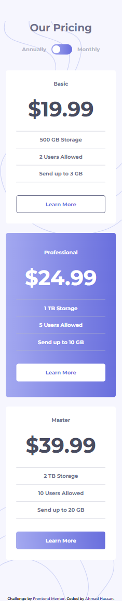
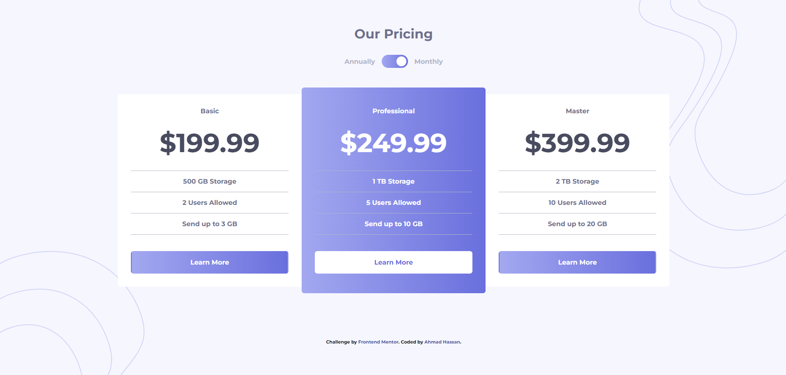

# Pricing Component With Toggle👨‍💻

## Project Overview 🌟

This is a front-end coding challenge completed for [Frontend Mentor](https://www.frontendmentor.io). The challenge was to build a pricing component with toggle and make it look as close to the provided design as possible.

## Technologies Used 💻

- HTML
- CSS

### The Challenge 📋

Users should be able to:

- View the optimal layout for the component depending on their device's screen size
- Control the toggle with both their mouse/trackpad and their keyboard
- **Bonus**: Complete the challenge with just HTML and CSS

## Screenshots 📷

| Mobile                                            | Desktop                                            |
| ------------------------------------------------- | -------------------------------------------------- |
|              |              |

## Live Demo 🚀

You can view the live demo of the project [here](https://pricing-component-with-toggle-js7.netlify.app/).